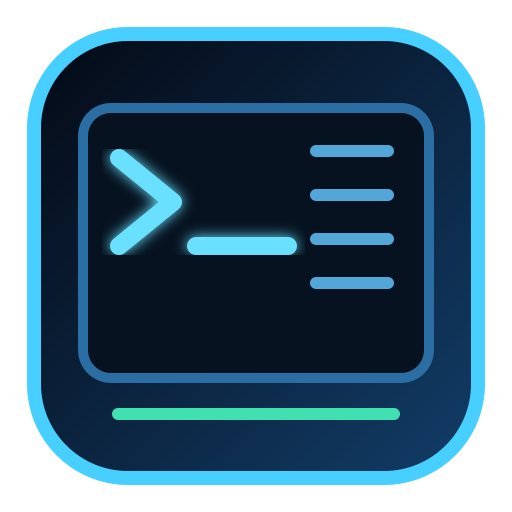

<div align="center">



# ⚡ Matrix Windows Commander 2.1.1

### Safe Windows diagnostics & repair command center

**Windows 10/11 · PySide6 / Qt 6 · PL / EN · Blue Matrix UI**

</div>

Matrix Windows Commander 2.1.1 keeps the safer modular architecture of v2 while restoring useful diagnostic and maintenance functions that existed in the original 31 KB PyQt5 build. The regression audit now covers the classic catalog much more closely, while destructive one-click actions remain intentionally excluded.

## Highlights

- modern **blue Matrix** desktop interface
- fast search and category filtering
- Polish/English interface with automatic system-language selection
- detailed command descriptions, exact command preview and one-click copy
- non-blocking execution with live stdout/stderr
- stop button and per-command safety timeout
- clear risk levels: read-only, repair, system change
- explicit confirmation before repair/change actions
- administrator detection with controlled UAC relaunch
- local history metadata stored in the user profile
- dedicated application icon shown above and embedded in the Windows EXE/window
- modular package instead of a 31 KB monolithic script
- real Windows GUI startup tests plus packaged EXE GUI smoke testing before release

## Restored diagnostic coverage

The regression audit compared the modern application with the classic command catalog and restored safe or explicitly-confirmed equivalents, including:

- hostname, Windows version and installed-driver information
- SFC, DISM and read-only/repair CHKDSK flows
- Disk Cleanup and the built-in Windows performance diagnostic report
- DHCP release/renew, DNS cache display/flush and TCP/IP/Winsock repair
- PathPing, route table, ARP cache and NetBIOS diagnostics
- saved **Wi-Fi profile names only** — stored keys/passwords are never requested
- Event Log channel listing, scheduled-task listing and read-only BCD enumeration
- Regsvr32 and Logman help without changing registration or logging configuration
- local/domain users and groups, account policy, shares, SMB sessions, open shared files and network view
- running processes, started services and Print Spooler status/start/stop
- an explicitly-confirmed **Close Notepad** action matching the classic build; it warns that unsaved Notepad text can be lost
- battery and short energy reports
- WSL status/list plus explicitly-confirmed default WSL installation

Version 2.1.1 still intentionally does **not** expose destructive legacy actions such as drive formatting, `diskpart`, registry deletion, forced shutdown/reboot, recursive directory deletion or `wsl --unregister` as one-click commands.

Some old entries such as `xcopy`, `robocopy`, `takeown`, `icacls` and `label` were only incomplete placeholders without a target/path workflow. They are not exposed as blind one-click commands because doing so would either fail or operate on the wrong location. A future file/path picker can reintroduce them safely as proper workflows instead of raw placeholders.

## Safety model

Commands are fixed executable/argument lists and run through Qt `QProcess`; arbitrary text is not passed to a shell. Read-only diagnostics run directly. Repair and system-changing commands are clearly labeled and require explicit confirmation. Commands that need elevation are marked and can use the controlled **Restart as administrator** action.

Network repair commands such as DHCP release and TCP/IP reset can temporarily interrupt connectivity. Use them only on Windows systems you administer or are authorized to maintain.

## Install from source

```powershell
git clone https://github.com/Swir/Matrix_Windows_Commander.git
cd Matrix_Windows_Commander
py -m venv .venv
.\.venv\Scripts\Activate.ps1
pip install -e ".[gui]"
python main.py
```

Check the version without opening the GUI:

```powershell
python main.py --version
```

## Administrator mode

Most information commands run in standard mode. Commands that genuinely require elevated rights are marked. Use the **Restart as administrator** button when needed. Repair/change commands also require explicit confirmation before execution.

## Privacy

The application does not upload command output. Execution history stores only command ID/title, exit code, timestamp and duration in the current user's application-data directory. Command output itself is not persisted.

## Development

```powershell
pip install -e ".[gui,test,build]"
pytest -q
python tools/build_icon.py
python main.py --smoke-gui
```

Core tests run on Python 3.10–3.14. Windows CI starts the real application window. The release pipeline generates the application artwork, builds `MatrixWindowsCommander.exe`, then verifies both `--version` and a packaged GUI startup before publishing EXE, portable ZIP and SHA256 checksums.

## Project layout

```text
src/matrix_windows_commander/
├── app.py
├── catalog.py
├── history.py
├── i18n.py
├── models.py
└── platform_utils.py
assets/
tests/
tools/
```

## Author

Developed by **Swir** — https://github.com/Swir
